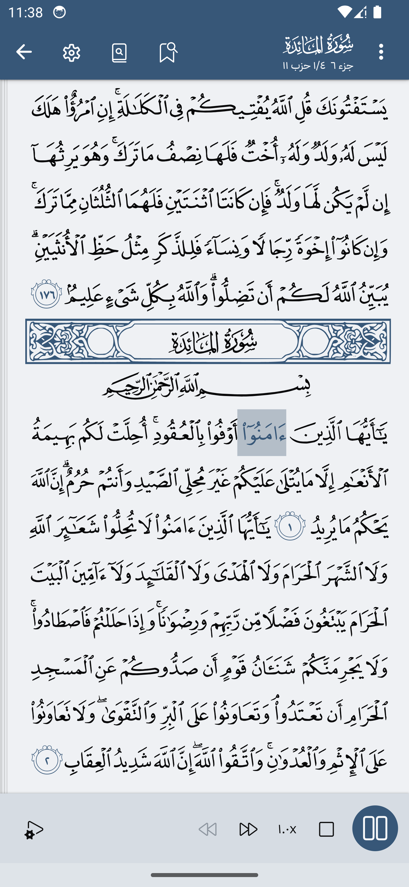

#  تطبيق توَّكل TAWAKKAL

توَّكل هو تطبيق إسلامي شامل يوفر مجموعة من الميزات لدعم نمط حياتك الإسلامي.

## الميزات

### 📖 القرآن
- **عرض المصحف**: التخطيط التقليدي لمصحف المدينة 15 سطر.
- **عرض دينامي**: قم بتخصيص حجم الخط للقرآن لتجربة قراءة شخصية.
- **مشغل الصوت**: استمع إلى تلاوات القرآن مع تحديد الكلمة المتزامنة.
- **مدير التنزيلات**: إدارة تنزيلات ملفات الصوت بسهولة.
- **الإشارات المرجعية**: حفظ وتنظيم الآيات المفضلة لديك لسرعة الوصول.
- **تفسير**: استكشاف معاني وشروح الآيات القرآنية.
- **مدير تنزيلات التفسير**: إدارة بسهولة محتوى التفسير المحمل.
- **البحث**: العثور بسهولة على آيات معينة أو مواضيع في القرآن.

### 🕋 أوقات الصلاة
- **أوقات دقيقة**: استلم أوقات الصلاة بدقة استنادًا إلى موقعك.
- **اتجاه القبلة**: اعثر على اتجاه القبلة باستخدام البوصلة المدمجة.

### 🤲 أذكار وتسابيح
- **تفاصيل الأذكار**: عرض وتتبع مختلف الأذكار.
- **عداد التسبيح الإلكتروني**: استخدم المسبحة الإلكترونية لتسجيل تسابيحك.

### 💖 أسماء الله الحسنى
- **قائمة شاملة**: اكتشف وتأمل في الأسماء الجميلة لله.

## 📸 صور للتطبيق

| مصحف المدينة مع تميز كلمة بكلمة عند الاستماع                           | كافة الأنشطة المتاحة حالياََ                                     |
| -------------------------------------------- | -------------------------------------------- |
|          |          |

  صنع بشغف ❤️ بواسطة مصطفى مصري ( Mostafa Masri )

